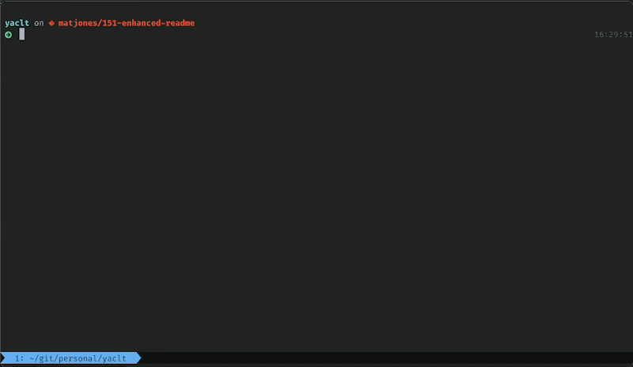

       

# <ins>Y</ins>et <ins>A</ins>nother <ins>C</ins>hange<ins> L</ins>og <ins>T</ins>ool

Friends don't let friends use git commit messages as change log entries; they should be more thoughtfully written.

`yaclt` is a highly configurable, file-based change log generator and validator. Include a change log entry file generated by `yaclt` in each Pull Request,
then use `yaclt` again to gather each individual entry into `CHANGELOG.md` as part of your release process.

## Features

- Customize the format of individual entries and `CHANGELOG.md` using [Handlebars](https://handlebarsjs.com)
- Add your own extra user-defined validations using pre- and post-command hooks
- Validate that all change log entries match a specified format (e.g. for use in CI pipelines)
- Automatically parse issue numbers from branch names
- Automatically checkout a new branch for generating release notes (branch name customizable with Handlebars)
- Neovim plugin ([`yaclt.nvim`](https://github.com/mrjones2014/yaclt.nvim))
- And more

The full set of options for each command can be found in [COMMANDS.md](./COMMANDS.md) or by running the command with the `--help` argument.

## Configuration

All command line flags and arguments can be specified in a configuration file. Most likely you will want most of your options to be specified in a configuration file.
Supported file names are `yacltrc.yml`, `yacltrc.yaml`, `yacltrc.json`, and `yacltrc.js` (`.js` config must use CommonJS format, e.g. `module.exports =`). Options passed
on the command line will override options from the configuration file if present.

If the working directory is inside a git repository, the tree will be traversed to the git root, using the first valid configuration file that is found. If no configuration file is found in the repo,
it will also check, in order of precedence, `$YACLT_CONFIG_HOME/`, `$XDG_CONFIG_HOME/yaclt/`, `$HOME/.config/yaclt/` for global configuration files.

If you are using a Javascript configuration file (e.g. `yacltrc.js`), any of the options can be a parameterless function which returns a value of the same type expected by the option. This can be useful,
for example, if you'd like to write some custom logic to parse the next release number based on git tags, or generate your messages automatically from git commit messages.

For options which are Handlebars templates (e.g. `--format`, `--releaseBranchPattern`, or `--changelogTemplate`), you may specify a filepath instead of a literal template string.
The CLI will check if the argument is a filepath to a file that exists, and if so, read the template from that file.

Documentation on customizing formats with Handlebars can be found in [handlebars-templates.md](./handlebars-templates.md).

### Configuration Recipes

Some common configuration recipes can be found in the [wiki](https://github.com/mrjones2014/yaclt/wiki/Common-Configuration-Recipes).

## Contributing

See [CONTRIBUTING.md](./CONTRIBUTING.md)
